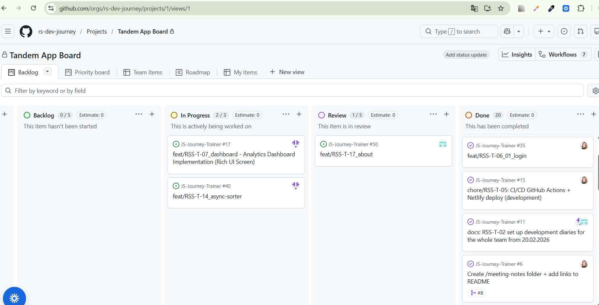

# JS Journey Trainer

JS Journey Trainer is a web application designed for practicing JavaScript and frontend concepts through interactive widgets.
The project aims to develop skills in front-end development, architecture, and teamwork.

Users can register, log in, complete exercises, and track their progress.

The project demonstrates implementation of:

- authentication using Supabase
- protected routing
- interactive widgets with state management
- reusable component architecture
- Feature-Sliced Design structure
- TypeScript typing
- CI pipeline and auto-deploy

The main goal of the project is to practice real-world frontend architecture and teamwork.

## Demo video

The video demonstrates the main user flow:

- user registration
- login
- navigation through the application
- completing interactive exercises
- viewing progress

📹 Demo (up to 8 minutes): [video](https://www.loom.com/share/8ecdbc99c44741e599dc5493a02febfc)

---

## What we are proud of

We focused on building a clear and scalable architecture using Feature-Sliced Design.

The project demonstrates separation of concerns between UI, business logic, and API layers.

We implemented reusable interactive widgets with controlled state and predictable behavior.

Special attention was given to:

- modular architecture
- TypeScript typing
- reusable components
- protected routing
- integration with Supabase authentication
- consistent UI patterns across features

We also configured CI pipeline and automatic deployment, which helps maintain code quality and project stability.

The team collaborated on architectural decisions and maintained consistent coding patterns across different modules.

## Links:

**Live demo:** https://js-journey-trainer.netlify.app/  
**Week 5 Checkpoint demo:** https://drive.google.com/file/d/1Dw_MGh1qHFBqfUgbGD3t8b6_X8OZb7UX/view

## CI

[](https://github.com/rs-dev-journey/JS-Journey-Trainer/actions/workflows/ci.yml)

## Team: Dev Journey

- **Valeria** — https://github.com/lertti
- **Evgeny** — https://github.com/kupzov2000
- **Sabina** — https://github.com/sabinabatrakova

## Self-assessment PR

Self-assessment describes personal contributions, implemented features, architecture decisions, and individual evaluation.

🔗 Self-assessment PR-lertti: [PR#55]()

🔗 Self-assessment PR-kupzov2000: [PR#56]()

🔗 Self-assessment PR-sabinabatrakova: [PR#54](https://github.com/rs-dev-journey/JS-Journey-Trainer/pull/54)

## Meeting notes

- [Sprint 1 - Planning 17.02.2026](./development-notes/meeting/meeting-notes_from_17.02.2026.md)
- [Sprint 2 - Architecture & Features Split 26.02.2026](./development-notes/meeting/meeting-notes_from_26.02.2026.md)
- [Sprint 3 - Discussion of feature readiness and project integrity 29.03.2026](./development-notes/meeting/meeting-notes_from_29.03.2026.md)


## Project board

- [GitHub Project](https://github.com/orgs/rs-dev-journey/projects/1)



## Best Pull Requests

1. **Authentication / Login flow**  
   [PR#25](https://github.com/rs-dev-journey/JS-Journey-Trainer/pull/25)
   Supabase authentication, validation, session restore, and protected access logic.

2. **True-False widget**  
   [PR#41](https://github.com/rs-dev-journey/JS-Journey-Trainer/pull/41) Create an isolated True-False widget for the practice flow. The widget should render one question, allow the user to choose True False, validate the answer locally, show explanation, and return the result via callback.
3. **Dashboard Analytics Dashboard Implementation**  
   [PR#24](https://github.com/rs-dev-journey/JS-Journey-Trainer/pull/24) Development of a complex interactive dashboard to visualize user progress in async sorting and other tasks. The component will aggregate data from the Custom Node.js Backend and external sources (colleagues' Supabase/Local Storage) using the Adapter Pattern.
4. **Tests page, Test Overview page and Test Run page**  
   [PR#26](https://github.com/rs-dev-journey/JS-Journey-Trainer/pull/26)
   Implemented the main structure of the Quiz feature in the JS Journey Trainer project. Added pages for browsing tests, viewing test overview with previous attempts, and started implementing the test run flow.


## Local Development Setup

### Clone the repository

```bash
git clone https://github.com/rs-dev-journey/JS-Journey-Trainer.git
cd JS-Journey-Trainer
```
Install dependencies for the frontend:
```
cd js-journey-trainer
npm install
```
If the project includes a backend server, install dependencies in the server folder:
```
cd ../server
npm install
cd ..
```
Start the application

Run the frontend locally:
```
cd js-journey-trainer
npm run dev
```
Frontend runs at:
```
http://localhost:5173/
```
### Start services separately (optional)

If needed, run frontend and backend separately in different terminal windows.

Start frontend:
```
cd js-journey-trainer
npm run dev
```

Start backend:
```
npm run server
```
Alternative way to start backend manually:
```
node server/index.ts or npx ts-node server/index.ts
```

Other useful commands

Lint project:
```
npm run lint
```
Format code:
```
npm run format:check
```
Run tests:
```
npm run test
```
Build project:
```
npm run build
```