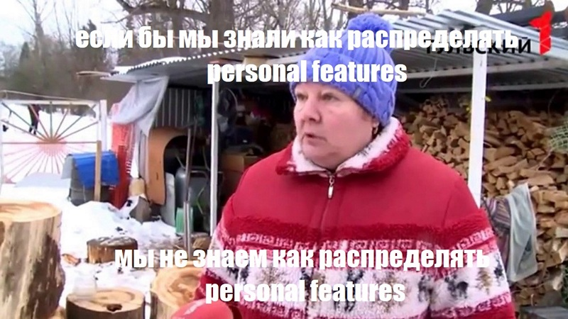

# Дата: 2025-02-20

- **Что было сделано:**  
Провела ревью кода настроек, которыми занимался Женя. Некоторые мои предложения были приняты. Сделали merge.  
Вечером провели митинг. Обсудили настройки конфигов: что менять, что оставить, как есть, что добавить.
Ещё раз Женя показал нам план, по какому будет строиться архитектура приложения.  
Также поговорили про CI/CD, Netlify. Но конкретных решений, кто и когда будет этим заниматься, не приняли.  

- **Проблемы:**  
Возникло небольшое недопонимание в команде. Договорились пушить дневники вместе в день перед дедлайном. Но пока я не была на связи, сокомандники уже запушили свои дневники.  
Так и не решили вопрос с  `lint-staged`. При коммите линтером будут проверяться все файлы, что на мой взгляд сильно замедлит процесс (особенно когда проект разрастётся).

- **Попытка решения:**  
Договорились перечитывать сообщения друг друг и обращать внимание на ключевые слова и термины.  

- **Затраченное время:** 2 часа
___  

# Дата: 2025-02-22

- **Что было сделано:**  
Утром созвонилась с ментором. Она помогла немного разложить по полочкам, что за чем должно идти в разработке. Обсудили работу в команде.  
Изучила теорию и прошла тест по Functional Reactive Programming. Пока сложно понять, что пригодится в проекте. Для себя отметила Observable и Signal и новые принципы работы с промисами. 
Набросала список фич, которые хотелось бы реализовать.
Вечером был долгий митинг по вопросам: разделение обязанностей, методология FSD, работа с веткой дневников, написание общей функции создания элементов. 

- **Проблемы:**  
Не понятно, как считать personal score. Ощущение, что набрать 250 баллов очень сложно. Учитывая, что многие пункты должны быть реализованы сразу на весь проект, становиться ещё сложнее добраться до этой заветной цифры. Имею ввиду фичи типа: Theme Switcher или i18n, Auto-deploy. Также хочу взять пункт *Custom Backend: Разработка своего бэкенда (Node.js/Python) с локальной базой данных*. Придётся ли его распространить на всё приложение?  
Не согласна с предложенной функцией `createHTMLElement`. На мой взгляд не стоит усложнять то, что должно быть простым. И лучше оставить её универсальной, а не писать под каждый элемент.  

- **Попытка решения:**  
Обсудили с командой пункты personal score. Пока мы как слепые котята)  
Пообщаюсь на тему выбора personal features с ментором, может что-то прояснится.

- **Мысли:**  
Если по сложным компонентам мы уже распределили обязанности, то над более мелкими предстоит ещё подумать.  
На следующей неделе нужно уже начинать реализацию dashboard, но две активности, которые на данные момент утверждены - это маловато (я задумала сделать круговую диграмму на D3.js).  
Пока больше вопросов, чем ответов. Буду советоваться с AI с чего начать, и какие технологии выбрать.  
После всех обсуждений хаос в голове и паника всё ещё присутствуют.

- **Затраченное время:** 3 часа (без теории по Functional Reactive Programming и написания дневника)  

  
