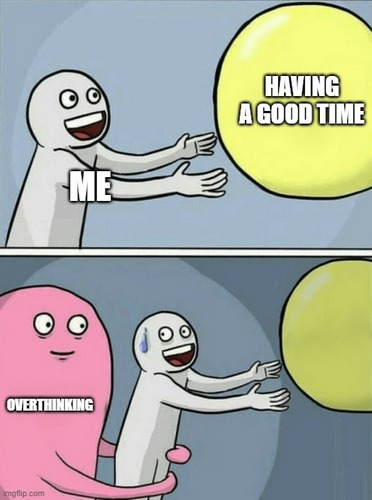

# Дата: 2026-02-28

 **Что было сделано:**  
Эту неделю по большей части готовилась к интервью CoreJS2. Повторила половину тем. Комбинирую разные источники: теорию школы, видеоуроки и базу, наработанную ранее на *Codecademy*. 
Набросала приблизительный дизайн компонента Dashboard.  

Параллельно финишировала курс **Setting Up a Server** на *Codecademy* — теперь в копилке ещё один подтвержденный сертификат и бейдж🏅. Написала первый маленький сервер на чистом Node.js. 

Сегодня с командой обсудили FSD. Но за 2.5 часа понимание так и не пришло, под конец ещё больше запуталась. Женя очень старался разложить всё по полочкам (так как он внедрял эту архитектуру и продумывал структуру папок), но мой мозг отчаянно сопротивляется.
Пока даётся мне сложнее, чем промисы, каррирование и Advanced TS.  

 **Проблемы:**  
 - *Муки выбора, какой стек использовать для сервера:*  
   - сначала AI советует использовать `Node.js` + `Express`
   - потом к стеку добавилась ещё `MongoDB`
   - следующий запрос: уже советует брать связку `Node.js` + `NestJS` + `SQLite`, так как с `NestJS` проще всего писать документацию для Swagger (благодаря декораторам документация генерируется автоматически). 
___ 
- Не сложилась целостная картина будущего проекта. Даже не определились, сколько у нас будет виджетов, что напрямую влияет на проектирование моего компонента *Dashboard*. Пока будет работать с моковыми данными. Постараюсь сделать универсальным, чтобы не зависел от количества тем, которые будут у Жени в квизе.  
После опыта с MVC сложно перестроиться под FSD. Не хочется разбираться, как должен делиться код на модули, есть желание сесть и начать реализацию своих компонентов без лишних отвлечений (а куда положить функцию отрисовки диаграммы, где должна храниться вся отрисовка страницы: в /entities или в /features, что мы кладем в /shared, а что в /entities).  

 **Попытка решения:**  
Согласовали с тимлидом план действий: я реализую логику в рамках одного модуля, а затем мы вместе декомпозируем её согласно правилам **FSD**.  
Освоила базовую теорию по **Node.js**, чтобы лучше понимать процессы на бэкенде. С базами данных я уже имела дело, так что с ними проблем возникнуть не должно.

 **Мысли:**  
Так как второй компонент у меня Async Sorter, решала задачки на понимание Event Loop. Это прям меня засасывает. Обожаю головоломки, квизы и прочие мозгодробительные штуки. Поэтому и выбрала такую тему, чтобы в первую очередь ещё раз самой разобраться. Плюс много пространства для фантазии, и возможность реализовать Drag & Drop, который не успела добавить в предыдущем проекте с пазлами.  
В целом много общаюсь с AI для понимания какой стек выбрать, какие технологии ещё нужно изучить. Попросила составить расписание на неделю. Хочу сначала детально изучить, с чем придётся иметь дело, составить план действий и потом уже приступить к пошаговой разработке.  
Не могу начать делать, пока не вижу целой картины. Возможно, слишком вдаюсь в детали и перескакиваю с темы на тему при поиске информации. Но, будем надеяться, что это "лечится".  

 