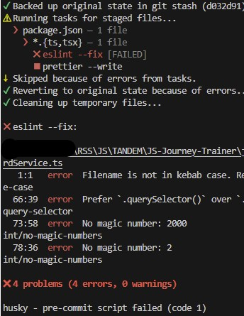
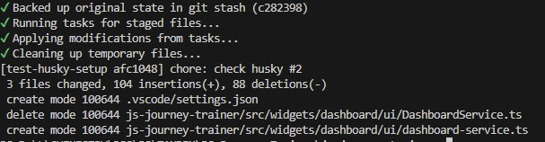

# Дата: 2026-03-11  

 ### Что было сделано:  

- Создала PR своего компонента (ветка RSS-T-07_dashboard), чтобы у сокомандников была возможность что-то прокомментировать и пройти Week 4 Checkpoint. Он в целом готов для работы с моками, но надо вынести всё-таки пару функций в отдельные модули. 
- Покрыла тестами всю логику и математику (адаптеры и стор). Получилось 7 штук, думаю, они покрывают 70-90 процентов всей бизнес-логики. Это те места, где легко ошибиться в формуле или случайно перезаписать данные. А вот само рисование графиков в D3 тестами не трогала — проверять unit-тестами саму генерацию SVG-секторов и дуг в **D3** сложно и  нет особого смысла.  
Сначала просто накидала тесты один за другим, но потом поняла, что в консоли это выглядит как "каша". Чтобы было логично и профессионально, сгруппировала их через `describe`. Теперь в отчете Vitest видна красивая древовидная структура: сразу понятно, какой модуль тестируется. Вместо точечных проверок `expect(...).toBe()` перешла на `toEqual()` для целых объектов — так код стал чище, а тесты надежнее, так как проверяют структуру целиком.  
- Провела небольшое ревью кода других участников команды. Это непросто из-за большого количества файлов, сложной структуры **FSD** и разрозноненности файлов из-за этого. Если в настройках я ещё что-то понимала и охотно комментировала, предлагая свои решения из предыдущих проектов, то именно `код` было проверять намного сложнее. Продолжаем усложнять себе жизнь😊. Будем надеяться, что этот опыт будет полезен в будущем.

### Проблемы:  

Оказалось, что у меня не были установлены плагины Prettier и ESLint. Из-за того того, что я раньше ночами делала всё на ноутбуке, а теперь пересела за комп, не сразу поняла, что плагины не установлены. Ещё каждый раз удивлялась, почему VSCode не предлагает `Format Document With...` и просто делала `Format Document`, так как думать было некогда. 
Но при очередной попытке сделать коммит вскрылась другая проблема  - не срабатывает **Husky**. Хотя Женя уверял, что у него всё работало в какой-то момент. Видимо, он не срабатывал потому, что лежит **внутри** папки, к которой пытается получить доступ с помощью команды `cd js-journey-trainer`. Из-за этого большинство файлов (даже полупустые example.ts) при принудительной проверке линтером "горели" красным. 

### Попытка решения:

Попробовала в отдельной тестовой ветке перенести папку `/.husky` и настроить `lint-staged` (который я предлагала внедрить ещё в одном из первых PR) - и УРА! Всё заработало на автомате 🚀. Теперь надо придумать? как грамотно всё провернуть, чтобы эти изменния без конфликтов смогли появиться у всех. Но это уже в следующей серии.

 
 
### Мысли:  

Сегодня планов нет. Как говорится, одни мысли...
Разве что наконец пройти интервью по CoreJS2 - и начать писать сервер для *Async Sorter.*  
Жуткая нехватка времени, и куча отвлекающих факторов вроде заданий для Checkpoint.😭  

### Code Review

- [PR #10: setup: RSS-T-03 Install and configure Vite, TypeScript, ESLint, Prettier, Husky, Vitest; create folder structure according to FSD](https://github.com/rs-dev-journey/JS-Journey-Trainer/pull/10#pullrequestreview-3831022141) — 9 комментариев (Предлгала решения по настройке ESLint, Prettier и свой вариант настройки Husky через `lint-staged`)  
- [PR #14: feat: RSS-T-04 Add reusable createElement utility](https://github.com/rs-dev-journey/JS-Journey-Trainer/pull/14#pullrequestreview-3847020343) — 3 комментария (Предлагала в интерфейсе для функции `createElement` поставить `classList`  раньше чем `textContent` для readability; заменить `attributes?: Record<string, string | number | boolean>` на `attributes?: Partial<HTMLElementTagNameMap[T]>` так как `Partial` от конкретного тега (например, HTMLAnchorElement) заставит IDE подсказывать только реально существующие свойства: href, target, rel и т.д.)  
- [PR #25: RSS-T-06: Auth UI + Supabase sign up/sign in + tests](https://github.com/rs-dev-journey/JS-Journey-Trainer/pull/25) — 2 комментария (Предложила сделать регулярное выражение для email строже, чтобы не проходили данные типа `1@1.1`, переназвать переменную в соответствии с тем, что в ней хранится)  
- [PR #26: feat: RSS-T-08 Add Tests page, Test Overview page and Test Run page](https://github.com/rs-dev-journey/JS-Journey-Trainer/pull/26) — 2 комментария (В функции `loadTestsList` вы предложила добавить обработку ошибок для `Promise.all`, чтобы приложение не «зависало» при сбое моков. Представила два варианта: использовать `try/catch` для полной отмены загрузки при любой ошибке или `Promise.allSettled`, чтобы отобразить доступные данные (например, список тестов), даже если часть запросов (например, прогресс пользователя) провалилась)
