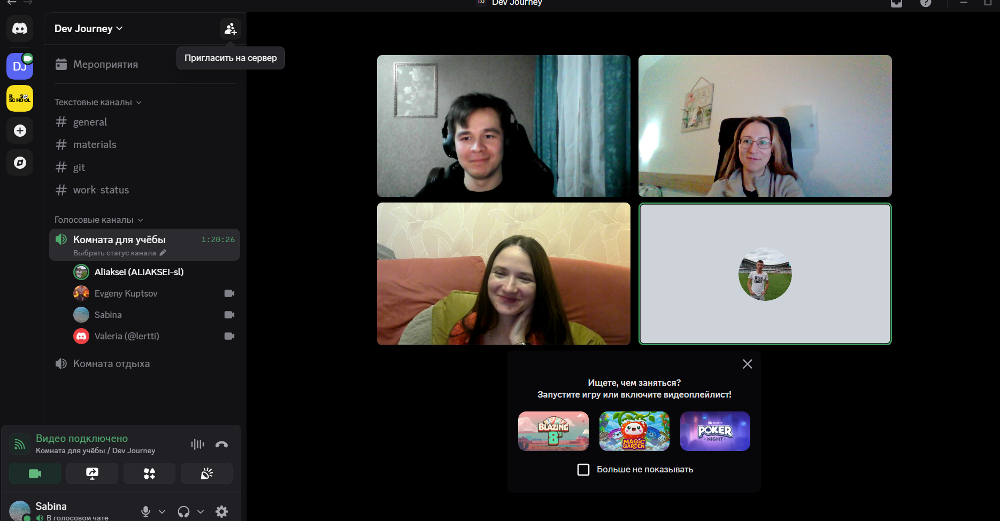

# Meeting Notes — Sprint 1 Planning

**Date/Time:** 17.02.2026, 20:30 (UTC+3)
**Attendees:** @kupzov2000, @lertti, @SabinaBatrakova, @aliaksei-sl
**Goal:** Review the project requirements and scoring criteria, align on the app concept, draft the first sprint plan, and distribute initial tasks among team members.

## 1. Decisions

- Agreed on the app concept.
- Assigned feature ownership among team members.
- Agreed to:
  - keep progress diaries twice a week;
  - set up a GitHub Project board and create issues in the repository.

## 2. Sprint plan / upcoming tasks

### Feature: Project setup (formatting, testing, FSD-like structure)
**Priority:** High

- Initialize the project using **Vite + TypeScript**
- Configure **ESLint + Prettier**
- Set up **Husky** for pre-commit hooks
- Configure **Vitest** for testing
- Create folders following FSD:
  - `app/`, `pages/`, `features/`, `entities/`, `shared/`
- Add `.gitignore` and basic scripts:
  - `dev/start`, `build`, `lint`, `format`, `test`

### Documentation / process
- Add development notes: create a `development-notes/` folder for each member’s diary.
- Add issues to the Tandem App Board: create a backlog of features.

## 3. Action items

- **@kupzov2000:** Setup project (Vite + TypeScript + ESLint/Prettier + Husky + Vitest + FSD) → Issue #1 #3 → **Deadline:** 19.02.2026
- **@kupzov2000:** Add description to `README.md` → Issue #2 → **Deadline:** 19.02.2026
- **@lertti:** Add `development-notes` folder structure → Issue #4, #5 → **Deadline:** 19.02.2026
- **@SabinaBatrakova:** Add Meeting notes structure → Issue #6, #7 → **Deadline:** 19.02.2026

## Attachments

