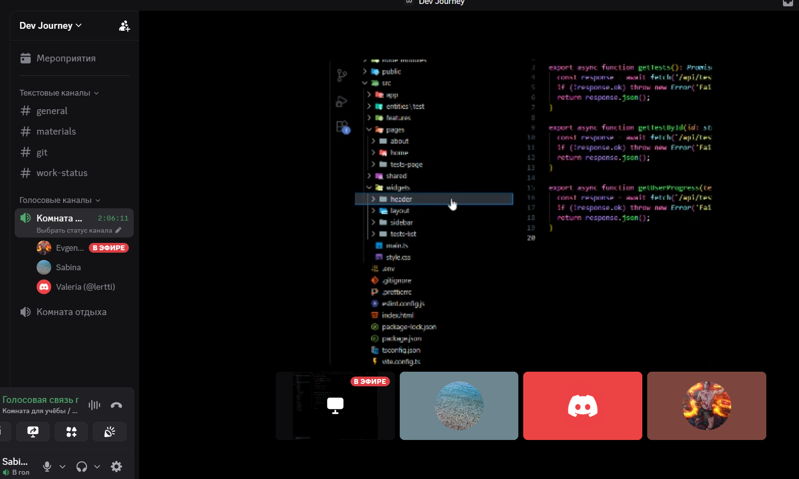

## Meeting: Sprint 2 - Architecture & Features Split

### Date/Time
**Feb 26, 2026 (UTC+3)**

### Duration
**2h 30m**

### Attendees
@kupzov2000, @lertti, @SabinaBatrakova

### Goal
Discuss the architecture (FSD), folder structure, imports/exports, define the app pages, and split features among the team.

---

## 1) Decisions

- Discussed the FSD architecture: Zhenya explained what should be inside each folder and how imports/exports should be organized.
- Agreed on the app pages:
  - `/login-and-registration`
  - `/practice`
    - `/quiz-test`
    - `/quiz-drag&drop`
    - `/quiz-true-false`
  - `/dashboard`
- Split feature ownership:
  - @kupzov2000 — `/quiz-test` + backend
  - @lertti — `/quiz-drag&drop` and `/dashboard`
  - @SabinaBatrakova — `/login` and `/quiz-true-false`

---

## Week 2 Checkpoints - Completed ✅

### Personal part (10 points)
Each participant completes this individually. All conditions are mandatory.

| # | Requirement | Details |
|---|------------|---------|
| 1 | At least 2 diary entries for Week 2 | Entries dated after Feb 23, merged into `main`. The standard diary rule is 2 entries per week
| 2 | Assigned to at least 1 issue | The participant is an assignee of at least one issue in the project repository. This confirms that the student has a concrete task. |

### Team part (10 points)
Completed once per team. All conditions are mandatory. Points are awarded only to participants who completed the personal part.

| # | Requirement | Details |
|---|------------|---------|
| 1 | The app is deployed | The README contains a link to a working deploy. The link returns HTTP 200 and contains HTML. Even a one-page skeleton counts as a deploy. |
| 2 | GitHub Actions workflow exists | The repository contains `.github/workflows/*.yml`. CI is configured—even if it currently runs only the linter. |
| 3 | At least 6 issues in GitHub | The repository has at least 6 GitHub issues. Planning can use any tool (Jira, Trello, etc.), but the 6 issues must be in GitHub (the check is done via the GitHub API). |
| 4 | Linter configured | The repository includes an ESLint configuration: `.eslintrc.*`, `eslint.config.*`, or an `eslintConfig` section in `package.json`. |

## Attachments

