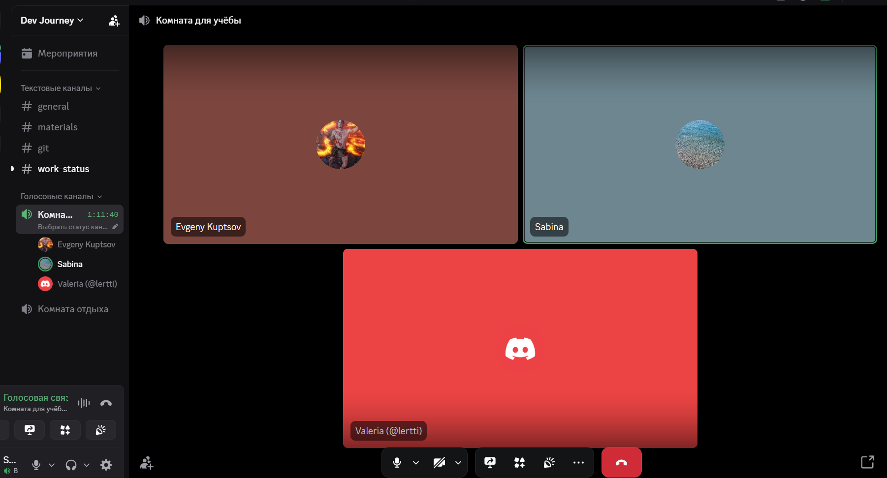

## Meeting: Sprint 3 — обсуждение готовности фич и целостности проекта.

### Date/Time
**March 29, 2026 (UTC+3)**

### Duration
**1h 30m**

### Attendees
@kupzov2000, @lertti, @SabinaBatrakova

### Goal
Обсудить готовность фич и целостность проекта.

### What we discussed

- Обсудили необходимость выделить общие стили для CSS-файлов, включая:
  - `font-size`
  - `background-color`
  - цвета кнопок
  - другие базовые UI-стили для единообразия интерфейса

- Valeria (@lertti) предложила добавить единый обработчик ошибок — функцию, которая будет принимать текст ошибки и централизованно показывать его в интерфейсе.

- Обсудили создание публичных API для получения данных о прохождении тестов пользователем.
  Это нужно для Dashboard.

- Обсудили, где хранить пользовательские данные помимо `id` и имени:
  - выбранную тему
  - настройки аватара (цвет, картинка)
  - настройки звука

- Приняли решение: если имя пользователя не загрузится из базы, в `header` и `dashboard` использовать обращение **"Explorer"**, так как это соответствует названию приложения.

- Подняли вопрос о создании логотипа для приложения и возможности добавить его в header.

- Зарезервировали ветки под задачи:
  - **12** — `true-false widget`
  - **13** — обработка ошибок
  - **14** — `async widget`

### Action items
- Выделить общие стили для CSS.
- Добавить единый обработчик ошибок.
- Сделать публичные API для Dashboard.
- Продумать хранение дополнительных пользовательских настроек.
- При желании — предложить идею логотипа для header.
- разобраться с ошибками деплоя на Netlify.

## Meeting: Sprint 3 — feature readiness and project consistency review

### Date/Time
**March 29, 2026 (UTC+3)**

### Duration
**1h 30m**

### Attendees
@kupzov2000, @lertti, @SabinaBatrakova

### Goal
To review the current readiness of the features and discuss the overall consistency of the project.

### What we discussed

- We discussed the need to define shared styles for CSS files, including:
  - `font-size`
  - `background-color`
  - button colors
  - other core UI styles to keep the interface consistent

- Valeria (@lertti) suggested adding a common error handler — a function that takes an error message and displays it in a centralized way across the interface.

- We discussed creating public APIs for retrieving user test progress data.
  This is needed for the Dashboard.

- We discussed where to store user data in addition to `id` and name, including:
  - selected theme
  - avatar settings (color, image)
  - sound settings

- We agreed that if the user’s name fails to load from the database, the `header` and `dashboard` should use **"Explorer"** as the default name, since it matches the app name.

- We also raised the idea of creating a logo for the application and adding it to the header.

- We reserved branches for the following tasks:
  - **12** — `true-false widget`
  - **13** — error handling
  - **14** — `async widget`

### Action items
- Define shared CSS styles.
- Add a common error handler.
- Create public APIs for the Dashboard.
- Decide how to store additional user settings.
- Consider a logo idea for the header.
- Investigate the Netlify deployment errors.
